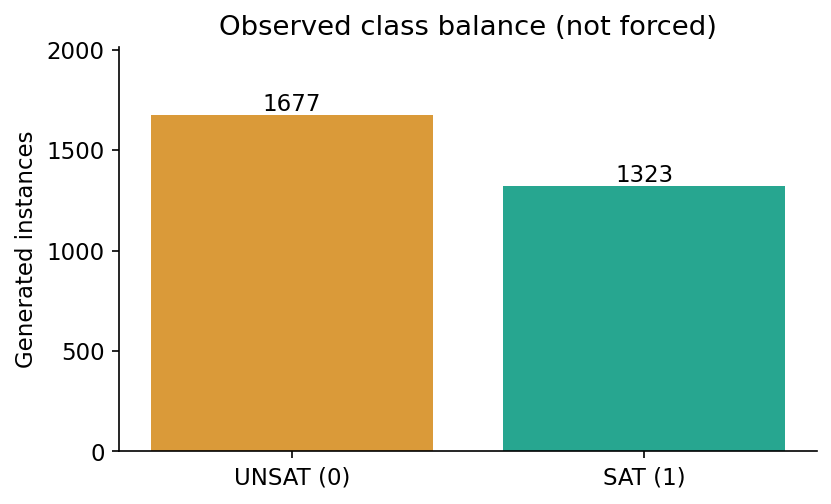
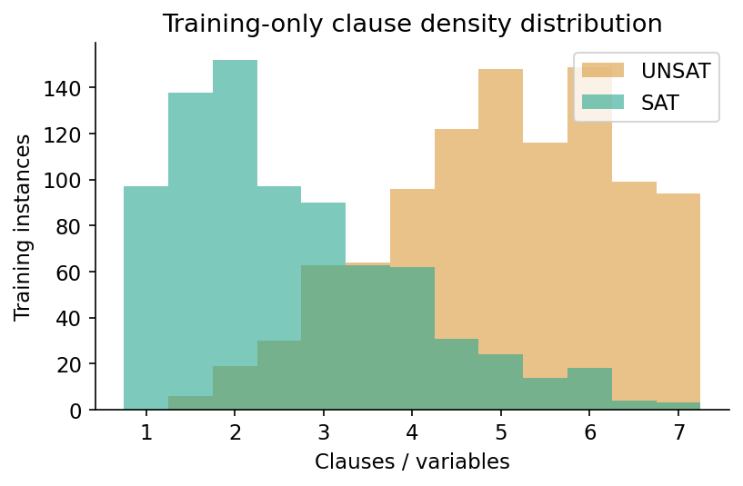
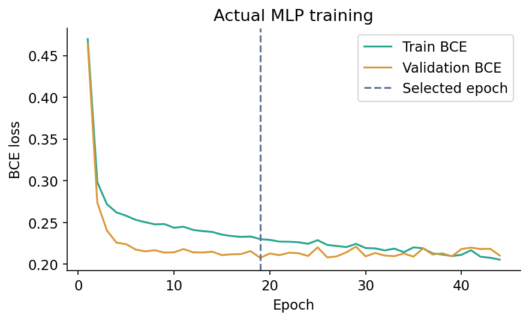
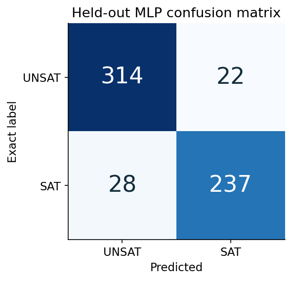

# CA6000 Assignment Report

# Learning to Predict Boolean Satisfiability

## 1. Use case and relationship to QRefactorBench

This CA6000 assignment studies **neural prediction of Boolean satisfiability**, using a program already present in the author's QRefactorBench project. Given a Boolean formula in conjunctive normal form (CNF), the model predicts whether at least one assignment satisfies every clause. A clause is an OR of signed literals; the whole formula is an AND of clauses. Positive k denotes variable x_k; negative k denotes its negation.

The source program is `cases/pilot/pilot-001/program.py`. Its `has_assignment` function exhaustively enumerates assignments and returns an exact Boolean result. The course task learns an approximate predictor for this behavior. It does **not** predict whether a program is quantumizable, practically worth quantumizing, or semantically safe to migrate. Those scientific benchmark labels remain DRAFT and are not training targets.

The assignment deliverables include runnable code, a dataset, cleaning/EDA artifacts, actual neural-network training, a written report, and an eight-slide English presentation. Name / student ID / partner information must be completed before submission.

## 2. Dataset acquisition and exact labels

The dataset is self-generated, not downloaded from Kaggle or claimed to be a mined real-world benchmark. `data.py` samples 3,000 distinct small CNF instances with a fixed NumPy generator seed of 2026. It samples 4 or 5 variables and one of three generator modes: 2-CNF, 3-CNF or mixed clauses. Clause counts are uniform from n through min(7*n, the number of possible distinct clauses). Clauses are sampled without replacement; a variable occurs at most once inside a clause and every declared variable must appear somewhere in the formula. No satisfying assignment is planted, no contradictory gadget is deliberately added, and no class-balancing filter examines the label.

Labels are computed by executing the original exhaustive program. A second, independently expressed Boolean evaluator checks all 3,000 saved labels in the tests. At most 32 assignments are needed per formula, so exact labeling is practical here. This establishes SAT/UNSAT labels for the saved inputs, **not expert quantum-migration ground truth**.

The generator sorts literals and clauses and enumerates all variable permutations (up to 5!) to obtain a canonical representation. It rejects repeats of this representation before any train/test split. This handles variable renaming and literal/clause order. It does not eliminate all logically equivalent formulas or all polarity-inversion symmetries. There were 3,101 generation attempts; attempts failing variable coverage or canonical uniqueness were rejected, leaving 3,000 groups. All accepted groups have distinct hashes.

Data are imported with `pd.read_csv('dataset/instances.csv')`. Each row stores an instance ID, canonical group hash, generator mode, variable count, JSON formula, 30 numerical structural features and the exact satisfiability label. Provenance records the generator/source/dataset SHA-256 hashes and parameters. The observed classes are **1,677 UNSAT and 1,323 SAT**; the imbalance was not forced.

The repository currently has no selected open-source license (UNLICENSED / NOASSERTION). This is a local course submission package, not a public benchmark release. No external dataset provenance or license is invented.

## 3. Error checking and cleaning

The original numeric audit found zero missing feature cells, duplicate canonical groups, invalid labels, nonnumeric cells, infinite values, negative count-like values or impossible literal totals. The original dataset is preserved unchanged. The source code and tests additionally establish valid formulas and exact labels.

As explicitly permitted by the assignment, teaching errors are injected **only into a training copy after splitting**: 8 missing cells, 3 text-valued numeric cells, 2 negative counts, 1 infinity, 1 impossible literal total of 100,000,000, 4 duplicated rows and 1 extra invalid-label row. `error_injection_log.json` records the edits; `training_dirty.csv` retains the corrupted copy. Validation and test rows are not corrupted.

Pandas cleaning applies `drop_duplicates('group_id')`, filters labels to {0, 1}, uses `pd.to_numeric(errors='coerce')`, replaces infinities with NaN and masks negative count-like values. Signed polarity-balance features are allowed to be negative and are not incorrectly removed. Under the declared generator there can be no more than 35 clauses and 3 literals per clause, so a total above 105 is invalid, not merely statistically unusual. This injected impossible value is changed to NaN. Valid extreme observations are not automatically discarded.

All missing/invalid cells are imputed with medians fitted **only on the training subset**. After repair there are 1,799 training records, no missing/invalid numeric cells, and **15 imputed feature cells**. A few derived-feature consistency relationships may be weakened by independent median imputation; this is a transparent pedagogical repair choice rather than reconstructing values from the clean original. The untouched formulas and source data remain available for review.

Standardization also fits only training data: x_scaled = (x - mean_train) / std_train. Zero standard deviations are replaced with 1. No preprocessing statistics are fitted on validation or test samples.

## 4. Elementary analysis and features

UNSAT constitutes 55.90% and SAT 44.10% of the original data. `raw_statistics.csv` contains all 30-feature original statistics, while `training_statistics.csv` describes the cleaned training data. Mean, median and sample variance (ddof=1) are reported below. The scaling transform's population standard deviation (ddof=0) is a separate statistic.

| Feature | Mean | Median | Sample variance |
|---|---:|---:|---:|
| n_variables | 4.52362 | 5.00000 | 0.24958 |
| n_clauses | 17.71762 | 18.00000 | 70.82011 |
| clause_variable_ratio | 3.90156 | 4.00000 | 3.08870 |
| total_literals | 45.53974 | 42.00000 | 555.29305 |
| positive_literal_fraction | 0.49963 | 0.50000 | 0.00551 |

The 30 inputs summarize variable/clause counts, clause density and widths, positive-literal proportion, occurrence statistics, signed polarity balance, variable-pair co-occurrence, variable degrees and mean clause variable overlap. Features are invariant to variable naming. They do not call a SAT solver or include its result, runtime, number of satisfying assignments, ID, formula hash or label. Feature extraction is deterministic syntax analysis, not an LLM call.

These aggregate features deliberately simplify representation and discard information. Different non-isomorphic formulas can share the same feature vector. The audit found 21 repeated feature rows and 4 identical feature vectors shared between train and test; no conflicting labels were observed within repeated-feature groups in this dataset. Therefore canonical formula separation is not the same as completely unique feature-vector separation. This limitation is retained rather than hidden.

## 5. Neural network and training protocol

After label-stratified shuffling with seed 42, the split is **1,799 training / 600 validation / 601 test** (approximately 60/20/20). Canonical group IDs are disjoint and saved. Exact duplicates are removed before splitting; the teaching duplicates are introduced only inside training and then removed. Class stratification uses labels to form the split, not to tune a prediction rule.

The PyTorch MLP is **30 → 64 ReLU → 32 ReLU → 1 logit**, with 4,097 trainable parameters. `BCEWithLogitsLoss` provides stable binary training. Sigmoid is used at inference with a threshold of 0.5 fixed before evaluation. Adam uses learning rate 0.001, weight decay 0.0001 and batches of 64.

Two configurations were predeclared: this MLP and a 30 → 1 logistic/linear classifier trained separately. A training-majority baseline is also evaluated. Both trainable models use a maximum of 200 epochs, validation-loss checkpoint selection, early-stop patience 25 and minimum improvement 0.00001. The test set is not used for model, epoch, feature or threshold selection.

The MLP ran for **44 epochs**, selecting **epoch 19**. The linear model ran for 200 epochs, selecting epoch 196. There was no architecture sweep or retry to obtain a preferred test score. Saved artifacts include weights, both loss histories, preprocessing statistics, split groups and environment metadata.

## 6. Prediction evaluation and interpretation

| Model | Test accuracy |
|---|---:|
| Training-majority baseline | 55.91% |
| Linear classifier | 90.85% |
| MLP | 91.68% |

The MLP correctly predicts **551 of 601** held-out instances. SAT is the positive class. Its precision is **91.51%**, recall **89.43%**, and F1 **90.46%**. Confusion matrix rows are exact [UNSAT, SAT], columns predicted [UNSAT, SAT]: `[[314, 22], [28, 237]]`. The model makes 22 false-SAT and 28 false-UNSAT predictions.

The MLP has five more correct predictions than the linear baseline on this split. This small difference is descriptive, not statistical evidence that neural nonlinear modeling is superior. No significance test, multiple-seed study, or cross-distribution evaluation was performed.

After the primary run, a transparent sensitivity analysis excluded the four test rows whose exact feature vectors appeared in training. On the remaining **597** examples, MLP accuracy is **91.62%**. This subset analysis did not retrain the model, change the primary split or replace its reported result; it is recorded in `feature_distinct_sensitivity.json`.

An exact solver is the source of the labels and can decide these small instances correctly; the MLP is not presented as a better solver. No timing comparison or computational/quantum advantage is claimed. The observed neural errors demonstrate why a prediction cannot serve as a satisfiability proof or silently replace an exact program contract.

## 7. Reproduction and interactive demonstration

Use `bash scripts/run_sat_coursework.sh --output /tmp/sat-course-reproduce` from the package root to reproduce training. The command refuses to overwrite an existing output directory. The supplied dataset is reused; regeneration is available via `python -m coursework.sat_case_study.data --output /tmp/sat-course-data`. Inspect hashes and configuration before comparing outputs.

The recorded environment is Python 3.10.21, PyTorch 2.7.1+cu128, Pandas 2.2.3, NumPy 1.26.4 and Matplotlib 3.9.4. It uses a single CPU thread and deterministic PyTorch algorithms. Cross-version/platform bitwise identity is not guaranteed.

Run `python -m pytest -q coursework/sat_case_study/test_study.py` to check canonicalization/invariant features, all 3,000 exact labels using an independent evaluator, group-disjoint splits, cleaning, training-only preprocessing, loaded-model metric reproduction and prediction input validation.

Run `bash scripts/run_sat_app.sh` and open `http://127.0.0.1:8766`. The page loads the trained weights and performs genuine inference on a selected or edited formula, then independently evaluates it with the original classical program. It deliberately includes an observed error example so users can inspect disagreement. Selected examples are from the existing test set, not additional unseen evaluation. Probabilities are uncalibrated model outputs, not guarantees. The interface accepts bounded formula data, not arbitrary executable source code.

## 8. AI assistance, limitations and sources

Codex was used as an AI coding assistant to draft and debug generation, cleaning, PyTorch training/inference, tests, charts, the demonstration interface and documentation. Actual local commands produced the saved data, weights and metrics; model scores were not generated as prose or manually invented. The student should read, reproduce and understand the submission and accurately describe their own contribution before submitting. No claim is made that all code was manually written by the student or already independently reviewed.

The assignment's primary contribution is a complete, auditable development workflow. Limitations include synthetic input distributions, very small formulas, a lossy feature representation, some feature-vector overlap, one fixed split/seed, and no proven predictive generalization beyond this generator. Median repair can also weaken dependencies between derived features. Larger or real-world SAT datasets, representation comparisons, cross-validation and leakage-aware feature-group splits are potential future work; none are reported as completed experiments here.

Sources and provenance:
1. User-provided CA6000 specification (due 20 September 2026): dataset acquisition, cleaning, elementary analysis, neural-network training/evaluation, report plus code, and disclosure of AI assistance.
2. QRefactorBench local source `cases/pilot/pilot-001/program.py`, functions `satisfies` and `has_assignment`; exact source hash in `dataset/provenance.json`.
3. This submission's `data.py`, `train.py`, `predict.py`, `test_study.py`, and `dataset/provenance.json` define the synthetic dataset and method.
4. Actual artifacts: `results/metrics.json`, `training_history.csv`, `linear_history.csv`, `test_predictions.csv`, `split_groups.json`, audit files and model weights.

The original benchmark cases, DRAFT quantumization labels, schemas, evaluator semantics and completed model experiments remain unchanged. This course study is not a new independent quantumization baseline or a quantum-advantage result.
