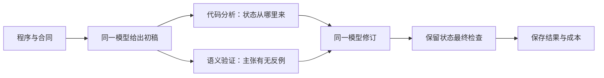

# 跟着 QRefactorBench 学 benchmark 与 agent workflow

更新于2026-09-26；第一步见 [N-045](../pilot/enhancement/state-workflow-v0.1/README.md)，
第二步见 [N-046](../pilot/enhancement/state-workflow-v0.2/README.md)，
第三步见 [N-047](../pilot/enhancement/state-workflow-v0.3/README.md)，
实际消融结果见 [N-048](../pilot/enhancement/state-workflow-v0.3/execution-20260926/REPORT.md)。
用户委托我们按判断推进，并在每一步解释“做什么、目的、实际效果”。
这里用项目自己的例子学习；后续结果以 PROJECT_STATUS 为准。

## 先认识四个部件

| 部件 | 在我们项目中的具体作用 |
|---|---|
| Benchmark | 给出经典程序、任务合同、输入条件和评价依据，让不同方案可以在同样任务上比较 |
| Model | 阅读程序，提名候选，判断适用性，提出条件映射方案 |
| Tools | 程序分析列出状态来源；验证器检查具体语义主张并返回有出处的证据 |
| Harness | 把输入交给模型，安排工具与修订步骤，保存记录、限制预算并连接评测 |

可以先把 agent 理解为一个能根据工具返回继续行动的模型系统。固定工作流把步骤安排在
代码里；自主 agent 让模型根据当前情况选择下一步。我们先做固定工作流，便于定位哪个
部件起作用。当前没有训练新模型、修改模型权重或建立多模型分工。
这一划分参考书的 [第1章：组件与工作流](https://github.com/bojieli/ai-agent-book/blob/04c88c53df962eb4375a0fad9ec041066529b358/book/chapter1.md)。

## 用一条真实失败走完闭环

Sol 已经找到 lit-009 的 pivot 位置；它的问题是提出的最大值谓词没有处理程序中可达的
NaN 状态。我们要帮助它检查“这个改写需要哪些前提，原程序真的保证吗”。

N-045最初只跑到“生成修订输入”。**N-048已经实际走完闭环**：生成5份新初稿，
各做4种修订，冻结原文主张绑定，再执行保留状态检查。共25次模型调用，不是25道题。
模型回答仍由协调者转录为可执行主张，尚未得到独立人类审核；保留状态也来自同一程序。

一次工具调用的记录应该能回答：输入是什么、工具实际做了什么、返回了什么、下一步用了
哪些结果。模型说“我检查过”是一条声明；执行记录才是工具确实检查过的依据。
本项目保存公开回答、工具输入输出和状态，不要求读取模型私有思维链。

## 消融：去掉一个部件，检查它是否有用

我们将分析记为 A，验证记为 V。这里 A/V 是增强组件，和案例的 A/B/C 上下文条件无关；
所有分支仍使用 lit-009 的 C 条件。

| 条件 | 获得什么 | 能回答的问题 |
|---|---|---|
| D：初稿 | 原程序与合同，一次模型调用 | 原始表现如何 |
| S：仅自检 | 初稿，再给一次检查机会 | 单纯多思考一次是否足够 |
| A：仅分析 | 初稿＋代码状态清单 | 整理代码依赖是否帮助修订 |
| V：仅验证 | 初稿＋主张的开发反例 | 具体失败证据是否帮助修订 |
| AV：二者都有 | 初稿＋分析＋反例 | 组合是否比单独部件更有用 |

例如 AV 比 S 好，说明整个工具包有增量；AV 与 V 相近，可能说明当前分析没有额外帮助。
这些只是待检验的解释。小样本波动、分析质量不足、任务天花板都可能造成没有差异。
不能先假定“工具越多越好”，也不能把一次无差异解释成永久无用。

书中 [实验1-1](https://github.com/bojieli/ai-agent-book/blob/04c88c53df962eb4375a0fad9ec041066529b358/chapter1/context/README.md)
给了有用的示范：分别去掉不同上下文成分，并区分循环结束、答案正确与是否有观测依据。
其 [实验日志](https://github.com/bojieli/ai-agent-book/blob/04c88c53df962eb4375a0fad9ec041066529b358/chapter1/EXPERIMENT_LEDGER.md)
还记录过一个消融问题：告诉模型“工具结果被隐藏了”本身又增加了信息。
我们因此在分支中直接省略未启用的观测，不添加“反例被隐藏”的提示。
借鉴的是实验原则，不是照搬书中的任务、数字或成功结论。

## 为什么“修好了这题”还不够

1. **多一次调用本身可能带来收益。** S/A/V/AV 都从同一初稿各修订一次；D 更便宜。
   次数相同不等于 token 或总成本相同，工具时间和模型成本要分别记录。
2. **看到答案就能改，不代表会处理新问题。** 用于反馈的开发反例不能再充当未见最终测试。
   旧 5×5、新 6×6 都已经是开发材料；同母案例的新矩阵也不是独立新程序。
3. **验证器也可能犯错。** 正确、等价和错误对照要测试它；无法转录的回答应保持未知。
4. **方案变谨慎不等于映射修好了。** 记录局部公式、条件范围、回退完整度和计划覆盖，
   合理保留经典也是允许结果。不会用一句“我放弃了”直接给整题满分。
5. **我们是因为已知失败才选择009。** 这适合开发诊断；要主张普遍提升还需新母案例、
   充分重复与独立审核。目前不计算能让人误解为稳定结论的显著性或综合排名。

书的 [第7章](https://github.com/bojieli/ai-agent-book/blob/04c88c53df962eb4375a0fad9ec041066529b358/book/chapter7.md)
启发我们同时记录结果、过程和成本；但不能仅由“换强模型分数不涨”确定瓶颈必在框架，
也可能有天花板或评价不敏感。我们仍需针对性检查。
[第9章](https://github.com/bojieli/ai-agent-book/blob/04c88c53df962eb4375a0fad9ec041066529b358/book/chapter9.md)
强调用已验证轨迹支持后续改进；保存日志本身并不等于能力进步。我们继续使用确定性
语义证据核验可判定主张，不把多个 LLM 的一致意见直接当作 gold。

## 当前做到了哪里，接下来做什么

| 步骤 | 目的 | 2026-09-26 实际状态 |
|---|---|---|
| 找到可复验失败 | 确定增强点 | N-044完成；限局部谓词，不否定完整回退 |
| 代码分析与反馈接口 | 让证据能进入修订上下文 | N-045有初版；分析为粗略词法依赖清单，反馈依赖人工绑定 |
| 四个修订分支 | 拆开工具贡献和额外调用作用 | 离线输入与状态记录已生成；12项检查通过 |
| 新回答的主张绑定与评测 | 避免把历史错误强套给新回答 | N-046完成明确审核绑定接口；支持等价、歧义、条件范围与未知，仍需协调者转录 |
| 冻结并运行同模型实验 | 测量是否改善与有无退化 | N-048完成25次真实调用；唯一明确错误初稿中V/AV有限修复，S/A仍有反例 |
| 跨母案例检验 | 测可迁移性 | 后续阶段，当前不作普遍增强主张 |

第二步出现了一个直观例子：人为错误策略“总选第一行”通过了全部开发请求，却在保留集合
的换行请求上失败。这说明开发反馈说“有限通过”是准确的，若改说“程序已经正确”就会误导。
同样，候选若声明“只处理有限中间值”，我们记录条件内通过及排除状态，不把排除困难状态
当成完整修复。N-046的49项测试检查这些规则；它们不是49次模型实验或49道benchmark题。

第三步已完成状态管理与隔离预检：26项新测试加49项旧回归通过，其中用模拟回答走完了
25个位置，并故意制造中断、无效回答和工具调用，确认不会悄悄重跑或丢掉失败。
这些是工程测试，不是75次模型实验，也不是质量提升证据。

这一阶段有个值得学习的实际发现：CLI配置写“关闭工具”，真正发送的请求里仍可能出现
工具，因为模型元数据还有一层强制设置。我们用断网环境里的本地接收器捕获请求，
定位并局部固定了配置；最终请求不含工具，私有目录也不可见。接收器只记录并拒绝请求，
没有模型推理。这说明agent实验不仅要记录prompt，还要核实框架实际提供了哪些能力。

## 第四步：真实消融教会了我们什么

25次Sol/medium调用全部完成，响应格式均有效。5份初稿只有1份给出了明确错误的选择
谓词；其余4份缺少足够明确、可检查的主张，不能当成正确答案。针对这一份错误初稿：

| 修订方式 | 实际效果 |
|---|---|
| 自检S | 两种语言解释都有反例 |
| 分析A | 仍有8/44个保留状态失败 |
| 验证V | 改为按顺序、严格大于才更新，44/44个保留状态通过 |
| 分析＋验证AV | 同样修正局部规则，44/44个保留状态通过 |

最直观的收获是：**给模型一个具体失败状态，在这次机会中帮助它改正了规则。**
但V和AV共享同一份错误初稿，只算一次配对机会；两者结果相同，没有证明组合更强。
有限状态通过也不代表全域证明、完整迁移正确或量子实现有效。

另外两份AV回答只承诺处理有限值，各通过31个状态、排除13个非有限状态。
这是缩小承诺范围；声明的回退还未执行，不能并入完整修复。其它回答中还有歧义、
无法转录的QUBO计划和新增错误主张。评测必须保留这些区别，否则一个总分会掩盖问题。

我们还发现一个实验设计问题：“证据不足”的固定反馈也写了pivot提示。
模型后来找到pivot，可能只是得到这个提示，未必是验证证据的功劳。
这与参考书“告诉模型工具被隐藏也会增加信息”的教训相呼应：控制条件本身也会影响模型。
下一步先离线设计一个**只有pivot提示、没有验证证据**的对照，同时整理模型需要补齐
哪些形式信息，以及分析工具怎样处理空候选和整个函数的提名。目的分别是隔离提示作用、
提高可检查回答的覆盖，以及避免分析因候选范围不合适而失效。这些改进尚未实现或运行。

本轮模型调用耗时合计约19.4分钟，协调者审核记录约10.1分钟墙钟（含工具与协调延迟，
不是独立人类标注工时）。25行评测重放一致，2429个旧文件保持不变。
这说明执行与记录可复核；方法收益仍只有上述有限证据。25次授权已用完，新实验需先
形成具体配置与预算。我们继续负责方法与本地推进，并分别解释“实现、实际运行、观察效果”。

## 第五步：把观察变成能区分原因的下一轮设计

[N-049离线设计](../pilot/enhancement/state-workflow-design-v0.1/README.md)已经完成，尚未调用模型。
我们核对25份回答后发现：没有规则、没有候选、范围过粗、QUBO没构造，不能用同一个
“请再检查”处理。已为它们分别准备补问信息，并给公开源码生成函数/语句目录。
这些是可审核的设计材料，尚未证明能让模型答得更好。

下一轮优先分开三层反馈：先只给原反馈中的pivot范围句，再加检查摘要，最后加具体
失败记录。对应自检S、范围提示C、摘要E、反例W。前三级各覆盖5份旧初稿，只有第2份
有真实反例可加，所以W只有1份，共拟议16次调用。这个不等分母来自实际适用机会，
必须用同稿配对解释，不能把W的一次成功与E的五份回答直接比较百分比。

为什么暂时不把补问和新分析一起接进去？因为同时改三个部件，即使结果变好也难说明
原因。先检查反馈的信息作用，再单独研究怎样增加可检查主张。16份输入已经生成并做
离线核对，下一步是适配运行配置和预检；新调用仍需具体预算授权。

还有一个容易忽略的教训：看过测试结果再据此改方法，那批测试就参与了方法开发。
上一轮44个保留状态以后可以检查是否破坏旧行为，但已不能作为下一轮全新的未见测试。
保存同一套测试便于回归；验证泛化则需要另外预先确定的未见案例。

## 第六步：正式花调用预算前，先演练执行流程

[N-050](../pilot/enhancement/feedback-control-v0.1/README.md)已把16份输入接入运行器。
32项新测试、49项相关回归和完整模拟流程通过，仍然没有新模型效果。

这次最值得理解的是“中断后怎么办”。如果已经发出请求，但程序还没记下结果，就直接
重跑，可能多花一次预算，甚至只保留了更好的答案。现在先写下调用位置，再发送；
恢复时有完成记录就接着记账，没有证据就停在待核查状态，不能默默重发。

另一个区别是“设置关闭工具”和“模型实际收到什么”。我们在断网环境用空认证文件、
本地接收端捕获真实请求，确认没有工具，且只挂载当前输入。接收端拒绝推理，所以这
不是一次模型实验，也没有验证订阅账户当前是否可用。完整16位置演练使用假传输，
其回答复制历史夹具；测试通过只说明流程按约定运作，不能作为能力提升证据。

现在配置已经可审核，下一步是对最多16次新订阅调用取得具体授权。获批后再观察
模型回答；S/C/E各5份、W只有1份的配对范围，以及已知回归检查的限制都保持不变。

## 第七步：消融结果可能推翻我们对“有用信息”的直觉

[N-051](../pilot/enhancement/feedback-control-v0.1/execution-20260927/REPORT.md)已实际完成16次调用。
在唯一明确错误的初稿上，仅给检查摘要E和给具体反例W都促使模型写出按序严格比较规则，
两者都通过44个已知状态；自检仍有3个反例，范围提示没有产生可检查的完整规则。

这次学到的是：**看到反馈后修好了，并不说明反馈里的每个部分都必要。**
E已提供范围、错误状态、解释标识、检查计数和限制；这次再添加具体反例，没有显示
额外有限正确性收益。只有一次配对，不能据此宣称反例普遍无用，也不能说一句“你错了”
就足够。我们比较的是这些实际信息包，不是想象中的单个词。

另一个观察更能指导下一步：12/16份回答仍没有可检查的完整局部规则。第3组自检也找到了
候选，第4组范围提示还诱发了整个求解器的形式化搜索包装；方案数量增加不代表正确。
下一步优先让模型补齐它自己计划中的规则和控制步骤，并允许它明确说未知。
这要与同调用次数的自检比较，避免把多一次输出机会误当作工具贡献。

本轮模型耗时约12.4分钟，审核记录约5.3分钟墙钟；全部16行重放一致，2921旧文件未变。
用户已委托同方向现有订阅额度，后续不再逐轮询问次数批准；我们仍会说明每轮要验证什么，
先固定协议，再报告真实效果和成本，不因额度充足就在旧实验里追加样本。

## 第八步：先判断是“没说清楚”还是“不会做”

[N-052](../pilot/enhancement/claim-elicitation-v0.1/README.md)把下一步缩成一个问题：
请模型把自己保留的方案写清楚，能否得到可检查的规则？同一初稿分别做普通自检和
信息补全，每支都只有一次调用，五份原始初稿全部保留。这是在控制额外思考机会。

补问只要求输入、状态、规则、控制步骤等通用信息，不告诉它该用什么正确算法。
允许回答未知或放弃量子方案；QUBO方案也有相应的编码、系数、约束和解码要求。
否则，强迫模型交一段可运行的规则，很容易把编造当成进步。

先完成81项测试与隔离预检，再执行N-053。此时尚无新效果结论。即使补问后能检查，
也需再区分正确、错误、只在条件内成立，以及超出判定器能力；“更详细”本身不是正确。

N-053实际执行后：第1组补出了44个已知状态全过的局部规则，第2组补出了有限值条件内
通过的规则，但要保留13个排除状态。第3/4组仍没提出替换方案。第5组从QUBO草案变成了
带具体系数和罚项界的构造，旧检查器无法判它。这说明同一个“证据不足”标签可能掩盖
不同情况：模型没给出细节，或者细节已经给出但检查工具覆盖不到。两支都仍有3份该标签，
不能只看计数宣称未知率下降，也不能因为标签没变就说补问完全没用。

接下来的合理动作是单独检查那份具体QUBO，而非继续重复提问。构造正确与是否值得
量子化仍需分开：这份回答自己承认构造系数已需平方级经典比较，已暴露最优行。
即便后来证明抽象公式正确，也不能据此声称量子收益。这正是工作流中“表达—验证—
收益判断”需要分别记录的原因。[完整结果](../pilot/enhancement/claim-elicitation-v0.1/execution-20260927/REPORT.md)。

随后的[N-054核查](../pilot/enhancement/rank-qubo-audit-v0.1/REPORT.md)支持了这个区分：
QUBO在31个已知有限状态和1704个事后合成状态中都得到正确唯一解，另可给出P>0的
数学论证。但它构造系数的经典工作已经找到了获胜行，无法据此推荐量子化。
我们没有把这条新证据回填成上一轮的“已通过”，而是保留新旧版本及各自检查范围。
下一步处理尚未解决的另一个瓶颈：模型没有给候选或只提名整个函数时，分析工具应如何
提供中性结构信息，而不替模型暗中挑出“正确位置”。

## 第九步：工具需要知道“没提名”和“分析后否定”的区别

[N-055](../pilot/enhancement/candidate-routing-v0.1/README.md)已把候选入口分清。
模型没给候选时，工具给出公开函数和语句目录，但不说“没有机会”；模型提名整个函数时，
保留该范围，不替它选择某行。只有提名精确匹配唯一完整语句，才调用已有依赖清单。

例如初稿写12–16行，起始行却是延伸到20行的循环。旧入口只看起始行，会让分析范围
超过提名范围。现在原始提名、所在函数、完整语句分别记录，跨边界关系明确展示。
31项新测试和49项回归确认这些行为；这还不是证明模型更会找候选。

下一步用自检、仅目录、目录加路由三组比较。仅目录这组很关键：如果它已经同样有效，
就不能把改善全部归因于依赖分析。每组都给同样的一次额外调用，不同时加入反例或补问。

N-057实际完成15次后，原本空候选的那份初稿中，目录和路由都引出了局部提名，自检仍为空。
但原本只提名整个函数的另一组，连自检也定位到局部；那一组不能算工具独有收益。
路由在第一组还产生了错误谓词：位置更具体，规则却不正确。因此不能用候选数量或
是否生成计划，替代语义正确性的测量。[本轮结果](../pilot/enhancement/candidate-routing-control-v0.1/execution-20260927/REPORT.md)。

这时合理的下一步不是因为额度充足就继续在同一道题上采样。这个母案例已帮助我们
设计多轮方法，不能继续充当未见程序。进入新母问题建设与参考评审涉及研究范围和
数据纳入决定，需要研究者确认；[D-036方案](NEXT_RESEARCH_SCOPE.md)把首批工作限定为
最多4份有来源、合同、谱系和评审义务的候选档案，不直接定gold或测试集。
这也说明自主工作流需要停止条件：工程实现可以自主推进，科学标签和数据范围有明确边界。
