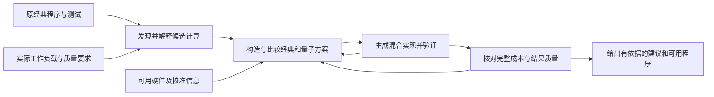

# 完整目标下的前沿调研结论

2026-09-28；N-060。**当前调研入口，以本版替代N-059的路线建议。**
前一版的论文/源码证据保留，其过早集中于“行为合同与成本”的排序不再作为执行依据。

## 目标保持不变

用户明确纠正：“不可能放弃我们的idea”。我们的研究目标始终是：

> 一个软件，基于用户已有量子计算机的能力，自动判断已有经典程序是否具有量子收益，
> 有依据时转化为可用的量子／经典混合程序。

调研用于确定从哪里接着做、如何超越现有方法。已有环节可以复用，困难环节可以换技术，
具体论文主张需要证据；这些都不等于放弃目标。某个输入应保留经典执行，也不等于放弃系统。
“合同与成本”现在与机会发现、硬件约束下的方案搜索、可用迁移验证一起比较，未预先选定。

## 结论

**现有技术已能在受限问题上完成识别、生成、选择和运行；从真实经典软件出发，
可靠决定是否值得迁移并交付可替换实现，仍有可推进的研究空间。**
这一判断来自下面各工作的能力与证据范围，不是“世界上没有人做过”的穷尽证明。

最相关的前沿不是单个榜单冠军，而是四条互补路线：

| 路线 | 最需要对照的工作 | 已到达的位置 | 对完整目标仍需解决的部分 |
|---|---|---|---|
| 源码识别与替换 | C2Q、Yamato自动卸载、CORK | 问题识别/实例提取、模式匹配替换或受限等价识别 | 非模板计算、运行时数据、上下文依赖及原接口的可靠恢复 |
| 应用生成 | QPipe；Q-Bridge为相邻ML域 | 从结构化需求生成、修复、运行和核对应用 | 从原程序而非已整理需求起步；生成结果与原任务之间的可检查联系 |
| 选择与收益分析 | QuaST、Predict and Conquer | 问题建模后预测采样/质量/运行成本、选择配置 | 源码引起的准备/验证等成本、强经典竞争者、特定硬件上的端到端判断 |
| 软件迁移与验证 | The Road to Hybrid Quantum Programs、QSynth、Hybrid Path-Sums | 专家迁移经验、受限合成和混合程序形式推理 | 将这些能力有效用于自动迁移，并验证覆盖率、正确性与全部开销 |

论文、固定代码位置、已演示结果及访问限制见[能力矩阵](CAPABILITY_MATRIX.md)。

## 以完整系统组织研究

图是研究目标的分解，不代表本仓库已实现这些能力。Agent可以负责提出候选、调用分析工具、
根据检查结果修订；工具和实验提供判断依据。研究创新可以在其中一个关键环节，
但评价必须说明该环节如何让完整目标前进一步。无需为了称为agent而安排多个角色。

## 哪些可用当前技术推进，哪些不能直接承诺

1. **当前已有手段，可以进一步研究效果：** 受限源码分析、已知算法映射、量子编译、
   小规模验证、成本建模、算法选择、工具辅助生成；关键在可靠性、覆盖与联合决策。
2. **当前可以给条件结论，不能冒充普遍保证：** 对未测规模/硬件的收益预测、
   自动恢复隐含需求、随机输出的正确性、强经典算法不断更新下的优势判断。
3. **需要算法或硬件进展：** 某实例超出机器可用深度/误差预算时，软件可以寻找更省资源的
   替代、分解或回退；如果没有满足要求的方案，工作流无法凭空提供资源或加速。
4. **有严格适用范围的理论边界：** 对任意图灵完备程序保证终止的全行为判定不可期待；
   无结构黑盒搜索存在查询下界。这些不排除受限输入上的有效软件，也不能扩大为
   “我们的量子收益目标不可能”。具体条件和来源见[技术边界](BOUNDARIES_AND_ROUTES.md)。

## 建议的推进次序

第一优先是**把真实源码中的计算可靠地变成可评估、可替换的量子候选**。
这是完整目标的入口：已有系统分别依赖问题标签、代码相似性或预先整理的需求；
我们可以研究有程序依赖与验证支撑的计算抽象和映射，扩大可处理的程序范围。

第二优先是**在指定硬件上联合选择替换范围、编码和求解配置**，并把全部成本与强经典方案
放在同一比较条件下。其研究增量应超出既有算法选择/不确定性预测。

第三条是**自动生成并验证可替换的混合实现**，特别是跨经典/量子边界的错误定位与修复。
它可以是主要贡献，也可以支撑前两条；不能仅因有测试或修复循环就宣称新方法。

这个次序是当前证据下的建议，未冻结论文方法。每条路线的前沿对手、具体新机制候选、
能用的现有技术、验证要求和调整条件见[路线比较](BOUNDARIES_AND_ROUTES.md)。
调整具体机制时继续服务同一目标。

## 本次完成了什么

完成前沿能力对照、公开源码静态核查、两篇重要补充论文全文阅读、技术边界分类、
三条技术路线比较，以及FSE所需证据与现有项目证据的差距说明。
已有三个本地材料也完成静态诊断，作为机制选型的线索；不是新案例或新实验成绩。

调研结果说明“下一步研究什么以及为什么”，尚不说明“所提新方法已经有效”。
下一阶段是有限的基线适配和诊断准备，不要求用户先选agent架构。
相关未取得的代码/实验、未完成的科学验证均见[证据与完成核对](EVIDENCE_AND_COMPLETION.md)。
