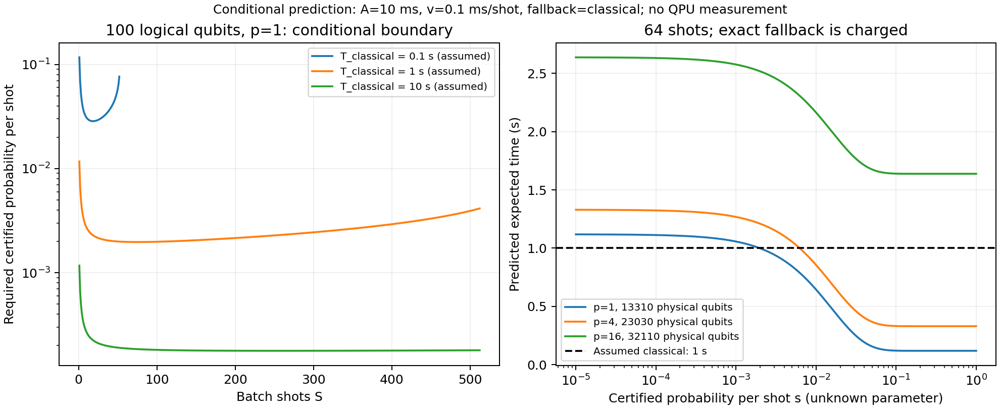

# 用小规模核验和公式推导大规模潜在量子优势

**已完成：结构公式推导、45组小规模核验、100/200/500逻辑qubit的实际资源估算，
以及含精确回退的潜在优势条件计算。无需大规模状态模拟或拥有真机。**
结论形式是“如果资源、成功率、经典成本和验证成本满足这些条件，模型预测有收益”，
而不是“已有设备实测加速”。[公式与证明](DERIVATION.md)区分结构推导、概率假设和物理模型。

## 1. 由构造推导的规律

对n个节点、m条边、p层QAOA，当前CX–RZ–CX实现有：

`Q_logical=n; N_H=n; N_CX=2pm; N_RZ=pm; N_RX=pn; N_measure=n`

`G_unitary=n+p(3m+n)`。

本图族m=2n，所以`G=n(1+7p)`；100qubit、p=1时为800门，不需要创建2^100维状态。
用c个matching分组的显式逻辑调度深度为`2+p(3c+1)`，含制备和测量两层；
旋转合成、纠错和蒸馏由指定物理模型估算；实际设备连接性与额外路由还需适用性核查。
小规模检验是核验推导及实现，不是用拟合代替证明。

## 2. 不做大规模模拟得到的物理资源

QDK1.32.3真实调用，固定角度gamma=pi/4、beta=pi/8，100ns物理门、500ns测量、
物理错误率1e-4，单shot估算错误预算1%。表中是指定模板和模型的结果，角度不是优化后的成功保证。

| 逻辑qubit | p | 逻辑门数（不含测量） | 物理qubit | 单shot预测 ms |
|---|---:|---:|---:|---:|
| 100 | 1 | 800 | 13310 | 1.600 |
| 100 | 4 | 2900 | 23030 | 4.900 |
| 100 | 16 | 11300 | 32110 | 25.340 |
| 200 | 1 | 1600 | 30429 | 3.100 |
| 200 | 4 | 5800 | 51597 | 13.160 |
| 200 | 16 | 22600 | 52577 | 48.440 |
| 500 | 1 | 4000 | 110165 | 11.053 |
| 500 | 4 | 14500 | 112125 | 33.712 |
| 500 | 16 | 56500 | 113105 | 124.348 |

100qubit、p=1的10ns/100ns/1000ns三个门时间模型均需13310物理qubit，分别为
0.16/1.6/16ms每shot；这是保持错误率和相对测量时间不变的三个假设点，不能推断真实设备
必能同时达到这些参数。物理qubit不是逻辑qubit，100逻辑位不等于100物理位。
各深度固定角度中可被化简的门由编译器处理，不能把该物理表用于任意优化角度或连接性。

## 3. 一个具体的100qubit潜在优势条件

采用表中p=1点，假设强经典方法完成同一精确任务需1秒；其余固定开销（含参数选择/编译摊销等）
共10ms，每shot解码及可靠证书处理为0.1ms；整批未成功则额外付完整1秒经典回退。
这些经典/验证成本是**条件坐标，不是本轮测量**。

令s为单shot产生并通过原精确合同证书的概率，S=64。在独立同分布假设下：

`T_expected = 0.01 + 64*(0.0016+0.0001) + (1-s)^64 * 1`

`           = 0.1188 + (1-s)^64` 秒。

因此，**s > 0.197415% 时，预期耗时低于1秒。**
若s=1%，模型给出约0.644396秒，即约1.552倍预期加速，已经计入失败回退。
这里没有将s=1%认定为已实现；它是可检查的设计目标，证书必须可靠且处理成本满足条件。
更深电路、更多shots都同时影响成功率与成本，曲线明确显示这种取舍。

不采用iid假设时，直接保留整批获证概率q：`T_expected=A+S(t+v)+(1-q)F`。
本例只需q>0.1188；同一随机运行的相关性不能靠重复次数自动消除。
这些是**期望延迟**条件，既不保证每次请求都更快，也不放松每次输出必须精确的要求。

## 4. 成功率证据如何接进来

45组n=4..12的小规模实例中，Hamiltonian公式和门级状态的重合度全部在1e-10容差内为1。
同时记录“任意最优割”概率与“全局最小mask及其补集”概率；后者才对应这里采用的简单补集
规范化目标。多组等价最优解时，前者不能替代后者。精确最优性/tie证书仍是独立义务。

以下仅展示p=1、每规模三个固定图的理想canonical-pair概率范围，**不拟合成100qubit成功率**：

| n | 最小 | 最大 |
|---|---:|---:|
| 4 | 0.018305826 | 0.32008252 |
| 6 | 0.0078125 | 0.13660376 |
| 8 | 0.0063252239 | 0.018773238 |
| 10 | 4.5842148e-05 | 0.00023587132 |
| 12 | 0.00017440013 | 0.0010255287 |

这个量依赖图、角度和深度。小规模波动说明仅按n外推不可靠；当前把未知成功率反求成阈值，
而不是因为未知就停止优势分析。将来任何理论下界、可验证特殊结构或有适用范围的经验模型，
都可以代入同一公式。

指定100qubit p=1点的QDK单shot错误估计为0.006894008。若另有依据保证这个量
控制输出事件概率偏差、并有完备可靠的目标证书，则`max(0,r_ideal-e)`是保守获证率下界。
因此在上述额外假设下，理想目标概率r_ideal > 0.886816%足以满足本例门槛。
这一转换是附条件推导，不把QDK错误预算当成已测总变差界或证书实现。

## 5. 验证、文件及边界

- 8项专项测试通过：含64种四节点图×3种深度的结构/状态核对、两节点闭式概率公式、
  所有有限成功/失败序列的期望成本核对、严格边界反解与100/200/500qubit结构检查。
- 45组小规模模拟核验通过；11次实际QDK调用全部成功；2376个条件网格点已保存。
- 175个运行前绑定文件未变；没有大规模状态模拟、新模型调用、真机任务、安装或正式case修改。
- [冻结协议](run/protocol.json)、[小规模证据](run/small-validation.json)、
  [大规模资源](run/large-resources.json)、[条件网格](run/conditions.json)、
  [具体算例](worked-example.json)、[运行验证](run/validation.json)可复核。
- 超过16节点是独立kernel分析，原wrapper未扩域。收益结论依赖可用精确证书、强经典任务时间、
  完整成本和概率条件；本轮未建立这些条件在某个100qubit实际工作负载上同时成立。

QAOA结构采用[原论文](https://arxiv.org/abs/1411.4028)的交替算子形式；
逻辑到物理估算复用[Microsoft资源估算器](https://learn.microsoft.com/en-us/azure/quantum/intro-to-resource-estimation)。
本包的门计数和收益不等式逐项推导，资源/概率/成本证据分别记录，未将工具拼装宣称为论文创新。
