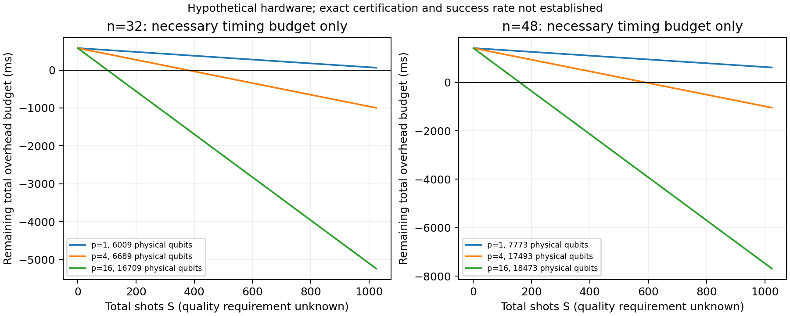

# 规模增长后的资源条件：实际诊断结果

四节点的无收益结果不能回答规模增长后的交叉点。本轮实际测量经典求解、调用QDK估算
8–64节点资源，并反求完整开销能占用的预算。**在32/48节点已出现正的必要时间预算，
但当前实现尚不能把它转成满足原精确行为的收益区域。**

## 结果

每行同一个固定种子的非二分图；一层QAOA、100ns门/500ns测量、物理错误率1e-4，
单shot资源估算错误预算1%。这些是假设硬件模型、未优化固定角度的资源模板。
经典侧为实测精确割值及最小mask恢复；8/16节点取MILP与优化枚举的较快结果。
其他规模只有MILP，不能宣称最强专用算法。时间为单机描述性观测，不是置信区间。

| 节点数 | 经典完成耗时 ms | 物理比特 | 单shot预测 ms | 假设64 shots后可留给全部其余成本的预算 ms |
|---|---:|---:|---:|---:|
| 8 | 0.088 | 3825 | 0.081 | -5.096 |
| 16 | 25.279 | 4165 | 0.165 | 14.719 |
| 24 | 199.398 | 5127 | 0.375 | 175.398 |
| 32 | 579.076 | 6009 | 0.505 | 546.756 |
| 48 | 1411.236 | 7773 | 0.780 | 1361.316 |
| 64 | 未完成 | 9488 | 1.035 | 未知 |

64 shots只是参数切片，**未证明够用**。正预算表示仍有值得检验的空间；若所需shots、
验证/回退、参数优化和其他开销超过预算，方案仍无收益。64节点超时未完成，不能把3秒
当成经典完成耗时，也不能据此宣称量子胜出。三个种子的原始记录全部保留。

## 具体条件而非单一qubit门槛

32节点p=1的指定资源点为6009物理比特，单shot 0.505ms。本机该实例经典完成约579.076ms。
所以必须同时满足：足够的指定物理资源、精确行为得到保证，以及
`0.505*S + H_ms < 579.076`。
其中H包括输入/电路准备、参数搜索、编译摊销、控制通信、解码、最优性/tie证书和回退。
取S=64时，H必须小于546.756ms。这个数值是必要预算，不是已测完整量子耗时。
物理模型点也不是所有架构的最小qubit门槛；更快门/更高并行度需要重新估计，不能独立任意调参。

如果采用验证失败后回退，令q为一批候选获得可靠证书的概率，V为平均验证成本，
F为失败后的条件平均回退成本，则期望收益条件是
`S*t_shot + H_other + V + (1-q)*F < T_classical`。
若另外确有F=T_classical，才可简化成`S*t_shot + H_other + V < q*T_classical`。
q不是“得到高割值”的概率；它要求完整最优性与最小mask证书通过。
不能用理想单shot成功率代替含物理错误、验证和回退的真实q。

## 找到的实际实现缺口

现有lit-001工具只接受切开全部正权边的候选。新图包含正权三角形，任何二分都至少
留下其中一条未切边，因此该证书对所有候选都拒绝。这是结构性判断，不依赖采样是否幸运。
现有wrapper还限制n<=16，现有电路解析器固定4qubit；本轮扩展的是独立kernel资源模板，
不是已经实现任意规模的LLM迁移。原正式案例与合同未修改。

因此之前的“小规模没有收益”不能支持终止研究；真正缺少的是一般实例上可计算的
成功率与有成本的精确验证方案。单纯放大现有四节点workflow会触发回退，不能得到有效交叉点。
本轮没有假装已补齐这个机制，也未证明它不可实现。

## 验证与可复核性

- 18次经典实例求解：14次完整完成、4次预算内未完成，均保留；18次QDK资源调用全部成功。
- 冻结前实现的8个小图求解与独立枚举一致；超时分支及严格盈亏边界检查通过。
- 事后强化经典对照：64种四节点图的MILP/优化枚举与原kernel输出完全一致；
  8/16节点六个规模实例的优化枚举与MILP一致。事后审计只加强对手，不筛选量子有利实例。
- 原始协议和源码hash在[run/protocol.json](run/protocol.json)，原始输出及manifest在run/；
  [审计](audit/validation.json)、[派生数据](derived.json)与绘图代码保留。
- 超过16节点属于独立kernel规模研究；没有新正式case/gold、近似许可、模型/QPU调用或依赖安装。
- 这是资源条件的开发诊断，不是自动方法效果、跨程序泛化、统计优势或真机收益证明。

运行环境与预算见[README](README.md)。SciPy求解状态及接口解释依据
[官方文档](https://docs.scipy.org/doc/scipy/reference/generated/scipy.optimize.milp.html)。
